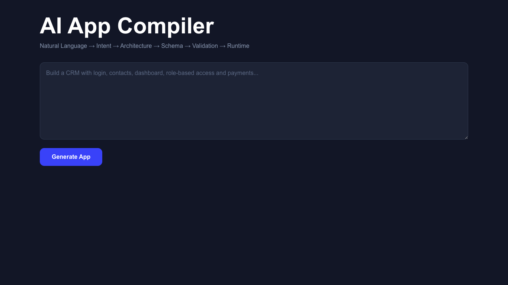
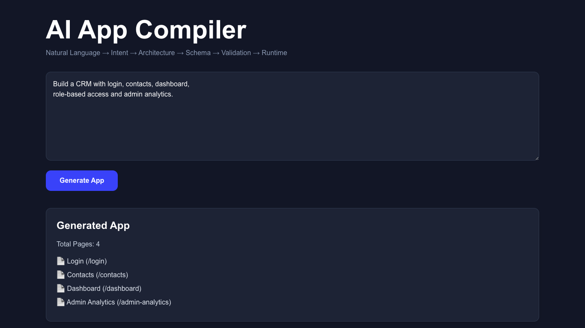
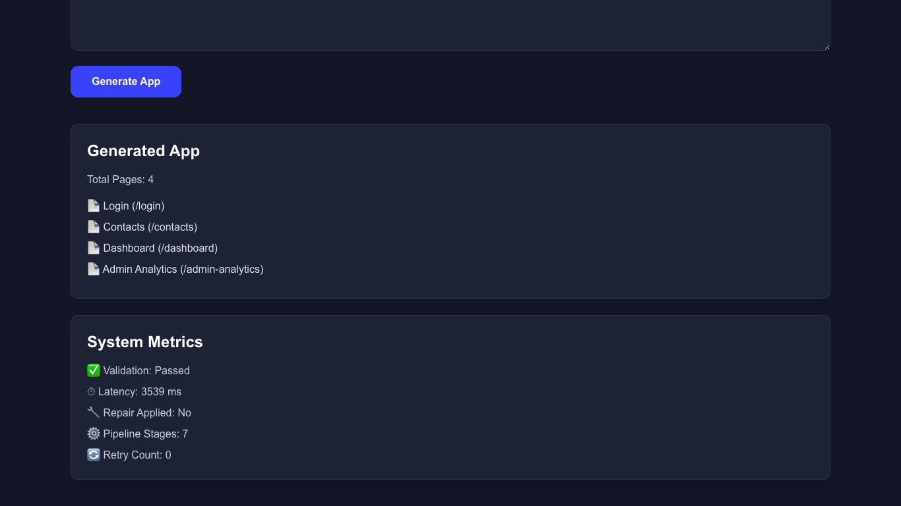

<p align="center">

# 🚀 AI App Compiler

### Transform Natural Language into Production-Ready Application Architecture using AI


</p>

---

# 🌍 Live Demo

### 🚀 Frontend

https://ai-app-compiler-ruddy-eight.vercel.app/

### ⚙ Backend API

https://ai-app-compiler-8nw9.onrender.com/

---

# 📖 Overview

AI App Compiler is a multi-stage AI-powered software generation pipeline that converts natural language into a structured application blueprint.

Instead of directly generating code, the system behaves like a software compiler.

It understands the user's requirements, extracts intent, designs the application architecture, generates schemas, validates them, repairs inconsistencies, and finally produces a runtime-ready application structure.

The project demonstrates how Large Language Models (LLMs) can be combined with deterministic validation to generate reliable application designs.

---

# 🎯 Problem Statement

Modern AI tools often generate applications directly from prompts, but they usually suffer from:

- Missing Requirements
- Hallucinated APIs
- Invalid Database Design
- Broken Relationships
- Inconsistent UI
- Authentication Errors

AI App Compiler solves these issues using a structured multi-stage compiler pipeline.

---

# ✨ Features

## 🤖 AI Powered

- Natural Language Understanding
- Intent Extraction
- Requirement Analysis
- Context Awareness

---

## 🏗 Architecture Generation

- Entity Identification
- Page Detection
- User Flow Creation
- Navigation Structure

---

## 🗄 Database Generator

Automatically creates

- Tables
- Columns
- Relationships
- Primary Keys
- Foreign Keys

---

## 🔌 API Generator

Generates REST APIs

- GET
- POST
- PUT
- DELETE

along with

- Request Body
- Response Body
- Endpoint Paths

---

## 🖥 UI Generator

Creates

- Login Pages
- Dashboards
- Forms
- Tables
- Analytics Pages

---

## 🔒 Authentication Generator

Supports

- User Roles
- Admin Roles
- Permission Mapping
- Authentication Schema

---

## ✅ Validation Engine

Performs

- Schema Validation
- API Validation
- Database Validation
- Role Validation
- UI Validation

---

## 🔧 Repair Engine

Automatically fixes

- Missing Fields
- API Errors
- Invalid Relationships
- Broken Schemas

---

## 🚀 Runtime Generator

Produces

- Runtime Pages
- Routes
- Application Metadata

---

## 📊 Metrics Engine

Returns

- Pipeline Latency
- Validation Status
- Repair Status
- Runtime Statistics
- Retry Count

---

# 🧠 AI Pipeline

```

Natural Language Prompt

↓

Intent Extraction

↓

System Designer

↓

Schema Generator

↓

Validation Engine

↓

Repair Engine

↓

Runtime Generator

↓

Generated Application

```

---

# ⚡ Example Prompt

```text
Build a CRM with login, contacts, dashboard,
role-based access and admin analytics.
```

---

# 🎉 Generated Output

✅ Intent

✅ Architecture

✅ Database Schema

✅ API Endpoints

✅ UI Pages

✅ Authentication

✅ Runtime

✅ Metrics

---

# 🏆 Why This Project?

Unlike traditional AI generators, this project behaves like a compiler.

Instead of directly producing code, it performs multiple verification stages before producing the final application.

This approach improves reliability, consistency, and scalability.

---

# 📸 Screenshots

## 🏠 Home Page



---

## ✍ Prompt Input



---

## ⚙ Generated Runtime



---

## 📊 Metrics


---

## 🔌 API Response


---
